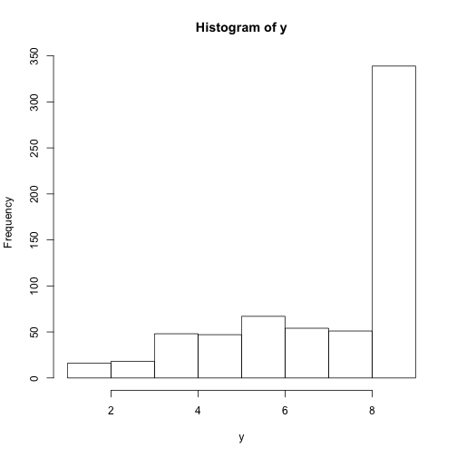
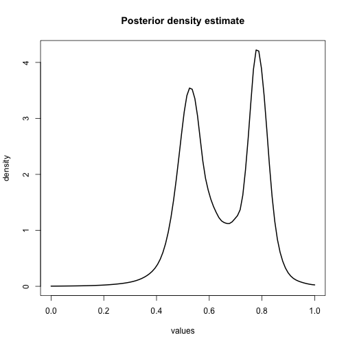

Rolling example
The beta-binomial distribution can also be motivated via an urn model for positive integer values of $\alpha$ and $\beta$ , known as the Polya urn model. Specifically, imagine an urn containing $\alpha$ red balls and $\beta$ black balls, where random draws are made. If a red ball is observed, then two red balls are returned to the urn. Likewise, if a black ball is drawn, then two black balls are returned to the urn. If this is repeated n times, then the probability of observing k red balls follows a beta-binomial distribution with parameters n, $\alpha$ and $\beta$.
Note that if the random draws are with simple replacement (no balls over and above the observed ball are added to the urn), then the distribution follows a binomial distribution and if the random draws are made without replacement, the distribution follows a hypergeometric distribution.


```r
    ## Not run:
        # Data
library(DPpackage)
```

```
## Loading required package: MASS
## Loading required package: nlme
## Loading required package: survival
## Loading required package: splines
##  
## DPpackage 1.1-6
##  
## Copyright (C) 2006 - 2012, Alejandro Jara
## Department of Statistics
## P.U. Catolica de Chile
##  
## Support provided by Fondecyt
## 11100144 grant.
## 
```

```r
data(rolling)
#first column include the number of success and the second the number of trials
y <- cbind(rolling$y1,rolling$y2)
head(y)
```

```
##      [,1] [,2]
## [1,]    7    9
## [2,]    4    9
## [3,]    6    9
## [4,]    6    9
## [5,]    6    9
## [6,]    6    9
```

```r
hist(y)
```

 

```r
                                        # Prior information
prior<-list(alpha=1,
            a1=1,
            b1=1)
                                        # Initial state
state <- NULL
                                        # MCMC parameters
mcmc <- list(nburn=5000,
             nsave=10000,
             nskip=3,
             ndisplay=20000)
#                                       Fitting the model
fit <- DPbetabinom(y=y,ngrid=100,
                   prior=prior,
                   mcmc=mcmc,
                   state=state,
                   status=TRUE)
```

This function fits a semiparametric Beta-Binomial model
$y_i|n_i,p_i \sim Binom(n_i, p_i), i =1, \ldots n$

$p_i|G \sim G$

$G|\alpha, G_0 \sim DP(\alpha G_0)$

where the baseline distribution is

$G_0 = Beta (a_1,b_1)$

To complete the model specification, $G_0$, is a conjugate prior in this model specification.


```r
fit
```

```
## 
## Bayesian Semiparametric Beta-Binomial Model
## 
## Call:
## DPbetabinom.default(y = y, ngrid = 100, prior = prior, mcmc = mcmc, 
##     state = state, status = TRUE)
## 
## Posterior Predictive Distributions (log):
##    Min.  1st Qu.   Median     Mean  3rd Qu.     Max.  
##  -8.074   -8.074   -8.074   -8.005   -8.074   -1.898  
## 
## Posterior Inference of Parameters:
## ncluster     alpha  
##    6.293     1.000  
## 
## Number of Observations: 320
```

```r
summary(fit)
```

```
## 
## Bayesian Semiparametric Beta-Binomial Model
## 
## Call:
## DPbetabinom.default(y = y, ngrid = 100, prior = prior, mcmc = mcmc, 
##     state = state, status = TRUE)
## 
## Posterior Predictive Distributions (log):
##    Min.  1st Qu.   Median     Mean  3rd Qu.     Max.  
##  -8.074   -8.074   -8.074   -8.005   -8.074   -1.898  
## 
## Precision parameter:
##           Mean      Median    Std. Dev.  Naive Std.Error  95%HPD-Low
## ncluster   6.29260   6.00000   1.91498    0.01915          3.00000  
##           95%HPD-Upp
## ncluster  10.00000  
## 
## Number of Observations: 320
```

```r
                                        # density estimate
plot(fit,output="density")
```

 

```r
                                        # parameters
plot(fit,output="param")
```

   

```r
## End(Not run)


##############################################################################
# Density estimation examples
# DPdensity fits univariate and multivariate versions of 
# the conjugate model of Escobar and West (1995).
# PTdensity fits marginalized (Hanson and Johnson, 2002) and finite Polya
# tree MPTs (Hanson, 2006) to univariate and multivariate data.  For 
# multivariate, only the marginalized version is fit.
##############################################################################
```

```r
library(DPpackage)
help(DPdensity) # look at documentation
help(PTdensity)
data(galaxy)
help(galaxy)
attach(galaxy)
speeds=galaxy/1000

# MCMC specifications and prior for DP mixture
mcmc=list(nburn=1000,nsave=2000,nskip=19,ndisplay=10000)
m=mean(speeds[,1])
s=var(speeds[,1])
prior=list(a0=1,b0=1,nu1=3,nu2=1,s2=s,m2=m,psiinv2=solve(0.1*s),tau1=0.2,tau2=2)

# Fit DP mixture, plot, and obtain LPML
fit.dpm=DPdensity(y=speeds,prior=prior,mcmc=mcmc,state=NULL,status=TRUE)
```

```r
summary(fit.dpm)
```

```
## 
## DPM of normals model for density estimation
## 
## Call:
## DPdensity.default(y = speeds, prior = prior, mcmc = mcmc, state = NULL, 
##     status = TRUE)
## 
## Posterior Predictive Distributions (log):
##    Min.  1st Qu.   Median     Mean  3rd Qu.     Max.  
##  -6.601   -2.788   -2.205   -2.575   -1.826   -1.578  
## 
## Baseline distribution:
##             Mean       Median     Std. Dev.  Naive Std.Error  95%HPD-Low
## m1-speed    2.013e+01  2.028e+01  2.438e+00  5.451e-02        1.501e+01 
## k0          1.972e-02  1.427e-02  1.973e-02  4.412e-04        7.047e-04 
## psi1-speed  8.171e-01  6.797e-01  5.667e-01  1.267e-02        1.234e-01 
##             95%HPD-Upp
## m1-speed    2.455e+01 
## k0          5.158e-02 
## psi1-speed  1.840e+00 
## 
## Precision parameter:
##           Mean      Median    Std. Dev.  Naive Std.Error  95%HPD-Low
## ncluster   9.53300   9.00000   3.50315    0.07833          3.00000  
## alpha      2.25018   1.96891   1.30729    0.02923          0.31355  
##           95%HPD-Upp
## ncluster  16.00000  
## alpha      4.83833  
## 
## Number of Observations: 82
## Number of Variables: 1
```

```r
plot(fit.dpm)
```

```
## Warning in max(aa$intensities + aa$density): no non-missing arguments to
## max; returning -Inf
```

```
## Warning in max(aa$intensities + aa$density): no non-missing arguments to
## max; returning -Inf
```

```
## Error in plot.window(xlim, ylim, "", ...): need finite 'ylim' values
```

 

```r
plot(fit.dpm,output="param")
sum(log(fit.dpm$cpo)) # LPML statistic
```

```
## [1] -211.1615
```

```r
# MCMC specifications and prior for MPT
mcmc=list(nburn=1000,nsave=2000,nskip=19,ndisplay=100,tune1=0.15,tune2=1.1,tune3=1.1)
prior=list(a0=5,b0=1,M=5)

# Fit MPT, plot, and obtain LPML
fit.mpt=PTdensity(y=speeds,prior=prior,mcmc=mcmc,state=state,status=TRUE)
```

```
## 
## MCMC scan 100 of 2000 (CPU time: 0.320 s)
## MCMC scan 200 of 2000 (CPU time: 0.532 s)
## MCMC scan 300 of 2000 (CPU time: 0.752 s)
## MCMC scan 400 of 2000 (CPU time: 0.965 s)
## MCMC scan 500 of 2000 (CPU time: 1.165 s)
## MCMC scan 600 of 2000 (CPU time: 1.368 s)
## MCMC scan 700 of 2000 (CPU time: 1.578 s)
## MCMC scan 800 of 2000 (CPU time: 1.801 s)
## MCMC scan 900 of 2000 (CPU time: 2.008 s)
## MCMC scan 1000 of 2000 (CPU time: 2.223 s)
## MCMC scan 1100 of 2000 (CPU time: 2.444 s)
## MCMC scan 1200 of 2000 (CPU time: 2.648 s)
## MCMC scan 1300 of 2000 (CPU time: 2.880 s)
## MCMC scan 1400 of 2000 (CPU time: 3.093 s)
## MCMC scan 1500 of 2000 (CPU time: 3.290 s)
## MCMC scan 1600 of 2000 (CPU time: 3.497 s)
## MCMC scan 1700 of 2000 (CPU time: 3.712 s)
## MCMC scan 1800 of 2000 (CPU time: 3.917 s)
## MCMC scan 1900 of 2000 (CPU time: 4.136 s)
## MCMC scan 2000 of 2000 (CPU time: 4.340 s)
```

```r
summary(fit.mpt)
```

```
## 
## Bayesian Density Estimation Using MPT
## 
## Call:
## PTdensity.default(y = speeds, prior = prior, mcmc = mcmc, state = state, 
##     status = TRUE)
## 
## Posterior Predictive Distributions (log):
##    Min.  1st Qu.   Median     Mean  3rd Qu.     Max.  
##  -6.360   -2.881   -2.276   -2.701   -1.920   -1.804  
## 
## Baseline parameters:
##              Mean      Median    Std. Dev.  Naive Std.Error  95%HPD-Low
## mu:speed     18.44241  18.38379   0.29740    0.00665         18.06985  
## sigma:speed   6.58417   6.15129   1.29439    0.02894          4.69025  
## alpha         1.95714   1.71930   1.14771    0.02566          0.34737  
##              95%HPD-Upp
## mu:speed     19.33576  
## sigma:speed   9.12278  
## alpha         4.36777  
## 
## Acceptance Rate for Metropolis Step =  0.4732683 0.4736585 0.7040244 
## 
## Number of Observations: 82
## Number of Variables: 1
```

```r
plot(fit.mpt)
```

```
## Warning in max(aa$intensities + aa$density): no non-missing arguments to
## max; returning -Inf
```

```
## Warning in max(aa$intensities + aa$density): no non-missing arguments to
## max; returning -Inf
```

```
## Error in plot.window(xlim, ylim, "", ...): need finite 'ylim' values
```

```r
plot(fit.mpt,output="param")
sum(log(fit.mpt$cpo)) # LPML statistic
```

```
## [1] -221.4555
```

```r
##############################################################################
# Generalized additive model example: enthanol data.
# pord=order of penalty prior, pord=1 gives random walk prior in Chapter 15.
# degree=degree of B-spline basis functions, d=3 gives cubic.
# beta0 and Sbeta0 are mean and covariance of fixed effects: intercept and
# any other linear terms in the model.
# Penalty *prior* is the same across additive transformations lambda_i ~ gamma(taub1,taub2).
# For Gaussian responses, precision tau ~ gamma(tau1,tau2).
##############################################################################
```

```r
library(lattice)
data(ethanol)
attach(ethanol)
help(ethanol)
plot(ethanol)
```

 

```r
help(PSgam)

# Model with only transformed E ( included
prior=list(taub1=0.01,taub2=0.01,beta0=rep(0,1),Sbeta0=diag(100,1),tau1=0.001,tau2=0.001)
mcmc=list(nburn=2000,nsave=2000,nskip=9,ndisplay=10000)
fit1=PSgam(formula=ethanol$NOx~ps(ethanol$E,k=20,degree=3,pord=1),
          family=gaussian(identity),prior=prior,mcmc=mcmc,ngrid=50,state=NULL,status=TRUE)
```

```r
plot(fit1)
```

   

```r
sum(log(fit1$cpo))
```

```
## [1] -27.33913
```

```r
# Additive model with additive E and C functions
fit2=PSgam(formula=ethanol$NOx~ps(ethanol$E,ethanol$C,k=20,degree=3,pord=1),
          family=gaussian(identity),prior=prior,mcmc=mcmc,ngrid=50,state=NULL,status=TRUE)
```

```r
plot(fit2)
```

    

```r
sum(log(fit2$cpo))
```

```
## [1] -6.221507
```

```r
# Model with transformed E but linear C
prior=list(taub1=0.01,taub2=0.01,beta0=rep(0,2),Sbeta0=diag(100,2),tau1=0.001,tau2=0.001)
fit3=PSgam(formula=ethanol$NOx~ps(ethanol$E,k=20,degree=3,pord=1)+ethanol$C,
          family=gaussian(identity),prior=prior,mcmc=mcmc,ngrid=50,state=NULL,status=TRUE)
```

```r
plot(fit3)
```

   

```r
summary(fit3)
```

```
## 
## Bayesian semiparametric generalized additive model using P-Splines
## 
## Call:
## PSgam.default(formula = ethanol$NOx ~ ps(ethanol$E, k = 20, degree = 3, 
##     pord = 1) + ethanol$C, family = gaussian(identity), prior = prior, 
##     mcmc = mcmc, state = NULL, status = TRUE, ngrid = 50)
## 
## Posterior Predictive Distributions (log):
##     Min.   1st Qu.    Median      Mean   3rd Qu.      Max.  
## -3.97600  -0.14310   0.20470  -0.09194   0.38260   0.44610  
## 
## Model's performance:
##    Dbar     Dhat     pD       DIC      LPML   
##     -2.815  -19.397   16.582   13.768   -8.090
## 
## Parametric component:
##              Mean       Median     Std. Dev.  Naive Std.Error  95%HPD-Low
## (Intercept)  1.1630570  1.1633470  0.1082995  0.0024217        0.9547691 
## ethanol$C    0.0499112  0.0497907  0.0076821  0.0001718        0.0341294 
## phi          0.0577307  0.0566723  0.0100179  0.0002240        0.0404386 
##              95%HPD-Upp
## (Intercept)  1.3776155 
## ethanol$C    0.0644005 
## phi          0.0782245 
## 
## Penalty parameters:
##                Mean      Median    Std. Dev.  Naive Std.Error  95%HPD-Low
## ps(ethanol$E)  0.355354  0.317776  0.162985   0.003644         0.102358  
##                95%HPD-Upp
## ps(ethanol$E)  0.641245  
## 
## Number of Observations: 88
```

```r
sum(log(fit3$cpo))
```

```
## [1] -8.090315
```

```r
# Model with transformed E but categorical C
prior=list(taub1=0.01,taub2=0.01,beta0=rep(0,5),Sbeta0=diag(100,5),tau1=0.001,tau2=0.001)
fit4=PSgam(formula=ethanol$NOx~ps(ethanol$E,k=20,degree=3,pord=1)+factor(ethanol$C),
          family=gaussian(identity),prior=prior,mcmc=mcmc,ngrid=50,state=NULL,status=TRUE)
```

```r
plot(fit4)
```

     

```r
summary(fit4)
```

```
## 
## Bayesian semiparametric generalized additive model using P-Splines
## 
## Call:
## PSgam.default(formula = ethanol$NOx ~ ps(ethanol$E, k = 20, degree = 3, 
##     pord = 1) + factor(ethanol$C), family = gaussian(identity), 
##     prior = prior, mcmc = mcmc, state = NULL, status = TRUE, 
##     ngrid = 50)
## 
## Posterior Predictive Distributions (log):
##     Min.   1st Qu.    Median      Mean   3rd Qu.      Max.  
## -3.26700  -0.12040   0.26260  -0.07849   0.36810   0.46290  
## 
## Model's performance:
##    Dbar     Dhat     pD       DIC      LPML   
##     -9.029  -28.936   19.907   10.879   -6.907
## 
## Parametric component:
##                      Mean       Median     Std. Dev.  Naive Std.Error
## (Intercept)          1.4598808  1.4616574  0.0703922  0.0015740      
## factor(ethanol$C)9   0.2551148  0.2560581  0.0814883  0.0018221      
## factor(ethanol$C)12  0.3833303  0.3812480  0.0840916  0.0018803      
## factor(ethanol$C)15  0.3940232  0.3945761  0.0855813  0.0019137      
## factor(ethanol$C)18  0.6100699  0.6112509  0.0868677  0.0019424      
## phi                  0.0536277  0.0527691  0.0096089  0.0002149      
##                      95%HPD-Low  95%HPD-Upp
## (Intercept)          1.3225921   1.6015071 
## factor(ethanol$C)9   0.0846581   0.4060414 
## factor(ethanol$C)12  0.2141041   0.5448001 
## factor(ethanol$C)15  0.2226422   0.5594646 
## factor(ethanol$C)18  0.4372328   0.7671870 
## phi                  0.0363956   0.0721768 
## 
## Penalty parameters:
##                Mean      Median    Std. Dev.  Naive Std.Error  95%HPD-Low
## ps(ethanol$E)  0.371256  0.331532  0.177035   0.003959         0.128358  
##                95%HPD-Upp
## ps(ethanol$E)  0.712713  
## 
## Number of Observations: 88
```

```r
sum(log(fit4$cpo))
```

```
## [1] -6.907407
```

```r
##############################################################################
# Generalized additive model example: O-Ring data of Table 8.1
# B-spline seems to overfit unless one is careful.  
# MCMC mixing can also be problematic.
##############################################################################
```

```r
failure=c(1,1,1,1,0,0,0,0,0,0,0,0,1,1,0,0,0,1,0,0,0,0,0)
temp=c(53,57,58,63,66,67,67,67,68,69,70,70,70,70,72,73,75,75,76,76,78,79,81)

mcmc=list(nburn=2000,nsave=2000,nskip=9,ndisplay=10000,tune=1.1)
prior=list(beta0=rep(0,2),Sbeta0=diag(1000,2))
fit.logit=  Pbinary(failure~temp,link="logit",  prior=prior,mcmc=mcmc,state=NULL,status=TRUE)
```

```r
fit.cloglog=Pbinary(failure~temp,link="cloglog",prior=prior,mcmc=mcmc,state=NULL,status=TRUE)
```

```r
fit.probit= Pbinary(failure~temp,link="probit", prior=prior,mcmc=mcmc,state=NULL,status=TRUE)
```

```r
sum(log(fit.logit$cpo))
```

```
## [1] -12.53418
```

```r
sum(log(fit.cloglog$cpo))
```

```
## [1] -12.00386
```

```r
sum(log(fit.probit$cpo))
```

```
## [1] -12.70459
```

```r
mcmc=list(nburn=5000,nsave=5000,nskip=19,ndisplay=10000)
prior=list(taub1=0.01,taub2=0.01,beta0=rep(0,1),Sbeta0=diag(1000,1))
fit1.additive1=PSgam(formula=failure~ps(temp,k=20,degree=3,pord=1),
          family=binomial(logit),prior=prior,mcmc=mcmc,ngrid=50,state=NULL,status=TRUE)
```

```r
sum(log(fit1.additive$cpo))
```

```
## Error in eval(expr, envir, enclos): object 'fit1.additive' not found
```

```r
prior=list(taub1=1,taub2=0.01,beta0=rep(0,1),Sbeta0=diag(1000,1))
fit2.additive=PSgam(formula=failure~ps(temp,k=20,degree=3,pord=1),
          family=binomial(logit),prior=prior,mcmc=mcmc,ngrid=50,state=NULL,status=TRUE)
```

```r
sum(log(fit2.additive$cpo))
```

```
## [1] -13.18678
```

```r
plot(fit1.additive)
```

```
## Error in plot(fit1.additive): object 'fit1.additive' not found
```

```r
plot(fit2.additive)
```

  

