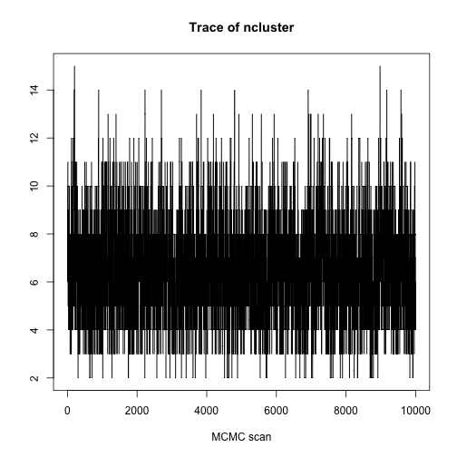

Rolling example


```r
    ## Not run:
        # Data
library(DPpackage)
```

```
## Loading required package: MASS
## Loading required package: nlme
## Loading required package: survival
## Loading required package: splines
##  
## DPpackage 1.1-6
##  
## Copyright (C) 2006 - 2012, Alejandro Jara
## Department of Statistics
## P.U. Catolica de Chile
##  
## Support provided by Fondecyt
## 11100144 grant.
## 
```

```r
data(rolling)
y <- cbind(rolling$y1,rolling$y2)
                                        # Prior information
prior<-list(alpha=1,
            a1=1,
            b1=1)
                                        # Initial state
state <- NULL
                                        # MCMC parameters
mcmc <- list(nburn=5000,
             nsave=10000,
             nskip=3,
             ndisplay=20000)
                                        # Fitting the model
fit <- DPbetabinom(y=y,ngrid=100,
                   prior=prior,
                   mcmc=mcmc,
                   state=state,
                   status=TRUE)
```

```r
fit
```

```
## 
## Bayesian Semiparametric Beta-Binomial Model
## 
## Call:
## DPbetabinom.default(y = y, ngrid = 100, prior = prior, mcmc = mcmc, 
##     state = state, status = TRUE)
## 
## Posterior Predictive Distributions (log):
##    Min.  1st Qu.   Median     Mean  3rd Qu.     Max.  
##  -8.074   -8.074   -8.074   -8.006   -8.074   -1.862  
## 
## Posterior Inference of Parameters:
## ncluster     alpha  
##    6.239     1.000  
## 
## Number of Observations: 320
```

```r
summary(fit)
```

```
## 
## Bayesian Semiparametric Beta-Binomial Model
## 
## Call:
## DPbetabinom.default(y = y, ngrid = 100, prior = prior, mcmc = mcmc, 
##     state = state, status = TRUE)
## 
## Posterior Predictive Distributions (log):
##    Min.  1st Qu.   Median     Mean  3rd Qu.     Max.  
##  -8.074   -8.074   -8.074   -8.006   -8.074   -1.862  
## 
## Precision parameter:
##           Mean     Median   Std. Dev.  Naive Std.Error  95%HPD-Low
## ncluster   6.2389   6.0000   1.9397     0.0194           3.0000   
##           95%HPD-Upp
## ncluster  10.0000   
## 
## Number of Observations: 320
```

```r
                                        # density estimate
plot(fit,output="density")
```

 

```r
                                        # parameters
plot(fit,output="param")
```

   

```r
## End(Not run)
```

